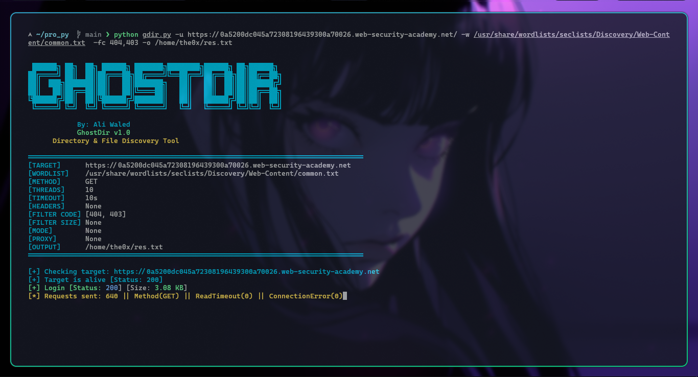

<div align="center">

```
 ██████╗ ██╗  ██╗ ██████╗ ███████╗████████╗██████╗ ██╗██████╗
██╔════╝ ██║  ██║██╔═══██╗██╔════╝╚══██╔══╝██╔══██╗██║██╔══██╗
██║  ███╗███████║██║   ██║███████╗   ██║   ██║  ██║██║██████╔╝
██║   ██║██╔══██║██║   ██║╚════██║   ██║   ██║  ██║██║██╔══██╗
╚██████╔╝██║  ██║╚██████╔╝███████║   ██║   ██████╔╝██║██║  ██║
 ╚═════╝ ╚═╝  ╚═╝ ╚═════╝ ╚══════╝   ╚═╝   ╚═════╝ ╚═╝╚═╝  ╚═╝
```

**GhostDir** — Directory & File Discovery Tool


*By Ali Waled*

</div>

---

## 📌 Description

GhostDir is a fast and lightweight directory and file brute-force tool written in Python.  
It helps penetration testers and security researchers discover hidden paths on web servers using a wordlist.

---

## ⚡ Features

- Multi-threaded scanning for high speed
- Custom HTTP method support (GET, POST, HEAD, etc.)
- Filter results by status code or response size
- Custom headers support
- Proxy support (Burp Suite / MITM)
- Burp mode for slow, controlled scanning
- Color-coded output for easy reading
- Human-readable response sizes (B, KB, MB, GB)
- Save results to output file

---

## 🔧 Installation

```bash
git clone https://github.com/the0x-pwn/ghostdir.git
cd ghostdir
python gdir.py u- <URL> -w <WORDLIST> [OPTIONS]
```

**requirements.txt**
```
requests
urllib3
```

---

## 🚀 Usage

```bash
python gdir.py -u <URL> -w <WORDLIST> [OPTIONS]
```

### Options

| Flag | Description | Default |
|------|-------------|---------|
| `-u`, `--url` | Target URL | Required |
| `-w`, `--wordlist` | Path to wordlist file | Required |
| `-X` | HTTP method (GET, POST, HEAD, OPTIONS, PUT, DELETE, PATCH) | `GET` |
| `-t`, `--threads` | Number of threads | `30` |
| `-T` | Request timeout in seconds | `10` |
| `-fc` | Filter by status code (comma-separated) | None |
| `-fs` | Filter by response size in bytes (comma-separated) | None |
| `-H` | Custom headers (e.g. `Key:Value,Key2:Value2`) | None |
| `--proxy` | Proxy URL (e.g. `http://127.0.0.1:8080`) | None |
| `--mode` | Run mode: `burp` (slow, 3 threads) | None |
| `-o` | Save results to output file | None |

---

## 📖 Examples

**Basic scan:**
```bash
python gdir.py -u https://example.com -w /usr/share/wordlists/dirb/common.txt
```

**Increase threads for faster scan:**
```bash
python gdir.py -u https://example.com -w wordlist.txt -t 60
```

**Use POST method:**
```bash
python gdir.py -u https://example.com -w wordlist.txt -X POST
```

**Filter out 404 responses:**
```bash
python gdir.py -u https://example.com -w wordlist.txt -fc 404
```

**Filter out specific page sizes (e.g. default error pages):**
```bash
python gdir.py -u https://example.com -w wordlist.txt -fs 1024,2048
```

**Add custom headers:**
```bash
python gdir.py -u https://example.com -w wordlist.txt -H "Authorization:Bearer token123,X-Custom:value"
```

**Route through Burp Suite proxy:**
```bash
python gdir.py -u https://example.com -w wordlist.txt --proxy http://127.0.0.1:8080 --mode burp
```

**Save results to file:**
```bash
python gdir.py -u https://example.com -w wordlist.txt -o results.txt
```

**Full example:**
```bash
python gdir.py -u https://example.com -w wordlist.txt -t 50 -T 15 -X GET -fc 404,400 -fs 239 --proxy http://127.0.0.1:8080
```

---

## 🖥️ Output Example

```
[+] admin       [Status: 200] [Size: 1.79 KB]
[+] .htaccess   [Status: 403] [Size: 239 B]
[+] api         [Status: 200] [Size: 86.91 KB]
[+] login       [Status: 200] [Size: 4.20 KB]

[*] Scan completed in 12.18s
[*] Total requests: 4614 | Found: 4
```

---

## ⚠️ Disclaimer

This tool is intended for **authorized security testing only**.  
Do not use against systems you do not own or have explicit permission to test.  
The author is not responsible for any misuse or damage caused by this tool.

---

## 👤 Author

**Ali Waled**  
Made with ❤️ for the security community.